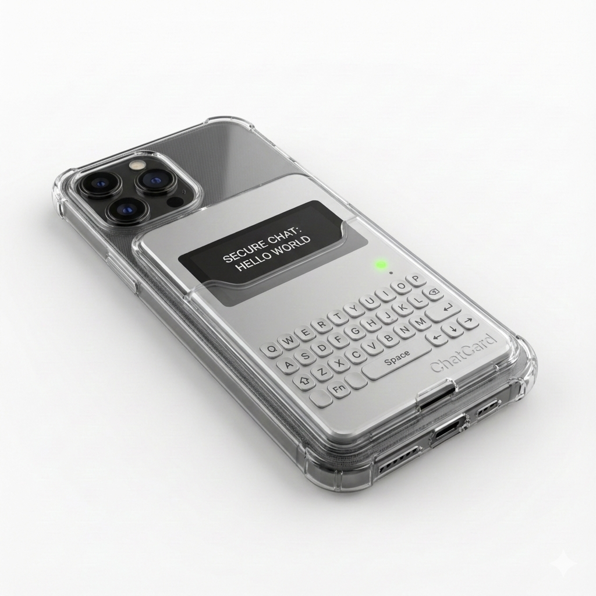
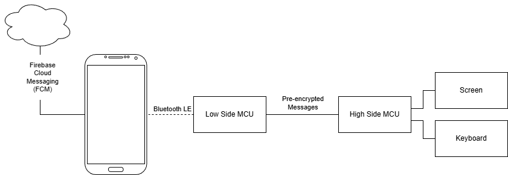

<!-- GUIDANCE:
1.2 System overview. This paragraph shall briefly state the purpose of the system and the
software to which this document applies. It shall describe the general nature of the system and
software; summarize the history of system development, operation, and maintenance; identify
the project sponsor, acquirer, user, developer, and support agencies; identify current and planned
operating sites; and list other relevant documents.

-->

# System overview

The *ChatCard System* is an end to end encrypted text messaging system.
The System works by providing each user with a minimal high-side text input and display device that connects to their phone via Bluetooth LE to transport the encrypted messages.
Encryption is performed inside the devices and the messages are then transported via the phone and public internet.
The intended form factor is a thin card that could be attached to the back of a phone via a phone case.

The System is currently a hypothetical product or small electronics project partially conceived to test the SysDoc systems engineering documentation tool.

The purpose of this System is to allow for secure communication of simple text messages.
The concept is for text input, display, and encryption are handled by a minimal and auditable high-side microcontroller.
Message transport including wireless and cloud protocols are handled by a low-size microcontroller, smart phone, and the public cloud.

